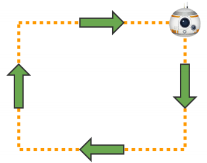

# Блок 4. Services в ROS. Часть 2

**ROS2 ОСНОВЫ ЗА 5 ДНЕЙ**

**Services в ROS Часть 2**


Ссылка на проект: [https://bit.ly/2FKJkd6](https://bit.ly/2FKJkd6)

Робот **BB-8**

Время до завершения: 3 часа. Чему вы научитесь с помощью этого устройства?

* Как оказать услугу
* Как создать собственное сообщение service server

## **Часть 2: Как сделать Service**

Здесь мы подкрепим то, что вы уже сделали в предыдущих частях этого раздела, а именно: создание server.

**Пример 3.7**

Вот что мы будем делать в этом примере:

* Внутри папки src пакета cpp\_unit\_3\_services, который был создан в предыдущем модуле, создайте новый файл с именем empty\_service\_server.cpp. 
* Создайте service server, который использует сообщения std\_srvs / Empty.srv, и при вызове печатает сообщение с информацией журнала. Мы добавим это сообщение: \#include «std\_srvs / srv / empty.h». Установленные включения можно найти здесь: / opt / ros / bouncy / include / std\_srvs. 
* Создайте файл запуска для запуска этого кода. 
* Сделайте необходимые изменения в вашем файле CMakeLists.txt и скомпилируйте пакет. 
* Запустите загрузочный файл, чтобы запустить исполняемый файл.

Выполнение программы \#1

```text
[ ]: cd ~/ros2_ws/src/cpp_unit_3_services
      touch src/empty_service_server.cpp
```


**C++ Program {3.2}: empty\_service\_server.cpp**

```text
[ ]: #include <inttypes.h>
      #include <memory>
      #include "rclcpp/rclcpp.hpp"
      #include "std_srvs/srv/empty.hpp"

      using Empty = std_srvs::srv::Empty;
      rclcpp::Node::SharedPtr g_node = nullptr;

      void my_handle_service(
              const std::shared_ptr<rmw_request_id_t> request_header,
              const std::shared_ptr<Empty::Request> request,
              const std::shared_ptr<Empty::Response> response)
       {
            (void)request_header;
            RCLCPP_INFO(g_node->get_logger(),"My_callback has been called");
        }

       int main(int argc, char ** argv)
       {
            rclcpp::init(argc, argv);
            g_node = rclcpp::Node::make_shared("empty_service_server");
            auto server = g_node->create_service<Empty>("/my_service",
            my_handle_service);
            rclcpp::spin(g_node);
            rclcpp::shutdown();
            g_node = nullptr;
           return 0;
       }
```

Теперь мы вносим необходимые изменения в **CMakeLists.txt** для его компиляции. Для этого просто добавьте эту новую строку в **CMakelists.txt**:

```text
[ ]: custom_executable(empty_service_server)
```

И добавить некоторые зависимости, связанные с **std\_srvs**

```text
[ ]: find_package(std_srvs REQUIRED)
      ...
      add_executable(${target}_node src/${target}.cpp)
          ament_target_dependencies(${target}_node
               "gazebo_msgs"
               "rclcpp"
               "std_msgs"
               "std_srvs")
       ...
```

Ваш CmakeLists.txt должен выглядеть примерно так:

**Setup {3.1}: CMakeLists.txt**

```text
[ ]: cmake_minimum_required(VERSION 3.5)
      project(cpp_unit_3_services)

      # Default to C99
      if(NOT CMAKE_C_STANDARD)
         set(CMAKE_C_STANDARD 99)
      endif()

      # Default to C++14
      if(NOT CMAKE_CXX_STANDARD)
         set(CMAKE_CXX_STANDARD 14)
      endif()

      if(CMAKE_COMPILER_IS_GNUCXX OR CMAKE_CXX_COMPILER_ID MATCHES "Clang")
         add_compile_options(-Wall -Wextra -Wpedantic)
      endif()

      # find dependencies
      find_package(ament_cmake REQUIRED)
      find_package(std_msgs REQUIRED)
      find_package(rclcpp REQUIRED)
      find_package(gazebo_msgs REQUIRED)
      find_package(std_srvs REQUIRED)
     
     if(BUILD_TESTING)
         find_package(ament_lint_auto REQUIRED)
         # the following line skips the linter which checks for copyrights
         # remove the line when a copyright and license is present in all
      source files
        set(ament_cmake_copyright_FOUND TRUE)
        # the following line skips cpplint (only works in a git repo)
        # remove the line when this package is a git repo
        set(ament_cmake_cpplint_FOUND TRUE)
        ament_lint_auto_find_test_dependencies()
     endif()
 
     function(custom_executable target)
         add_executable(${target}_node src/${target}.cpp)
         ament_target_dependencies(${target}_node
               "gazebo_msgs"
               "rclcpp"
               "std_msgs"
               "std_srvs")
         install(TARGETS ${target}_node
         DESTINATION lib/${PROJECT_NAME})
      endfunction()

      # Adding Services
     custom_executable(cpp_simple_service_client)
     custom_executable(cpp_simple_service_dummy_server)
     custom_executable(cpp_simple_service_client_ex3_1)
     custom_executable(empty_service_server)

     ament_package()

     # Install launch files.
     install(DIRECTORY
     launch
     DESTINATION share/${PROJECT_NAME}/
     )
```

Теперь мы вносим необходимые изменения в **package.xml** для его компиляции. Для этого просто добавьте эту новую строку в **CMakelists.txt**:

```text
[ ]: <depend>std_srvs</depend>
```

Ваш package.xml должен выглядеть примерно так:

**Setup {3.2}: package.xml**

```text
[ ]: <?xml version="1.0"?>
      <?xml-model href="http://download.ros.org/schema/package_format2.xsd"
      schematypens="http://www.w3.org/2001/XMLSchema"?>
      <package format="2">
          <name>cpp_unit_3_services</name>
          <version>0.0.0</version>
         <description>TODO: Package description</description>
         <maintainer email="user@todo.todo">user</maintainer>
         <license>TODO: License declaration</license>
  
       <buildtool_depend>ament_cmake</buildtool_depend>

      <depend>std_msgs</depend>
      <depend>rclcpp</depend>
      <depend>gazebo_msgs</depend>
      <depend>std_srvs</depend>

      <test_depend>ament_lint_auto</test_depend>
     <test_depend>ament_lint_common</test_depend>

      <export>
          <build_type>ament_cmake</build_type>
      </export>
  </package>

```

А теперь мы скомпилируем все **cpp\_unit\_3\_services** для обновления изменений: 

Выполнение программы \#1

```text
[ ]: . /home/user/.bashrc_ros2
      cd ~/ros2_ws
      colcon build --symlink-install --packages-select cpp_unit_3_services
```

Вывод программы \#1

```text
[ ]: Starting >>> cpp_unit_3_services
      --- stderr: cpp_unit_3_services
      /home/user/ros2_ws/src/cpp_unit_3_services/src/empty_service_server.cp
      p: In function ‘void
       my_handle_service(std::shared_ptr<rmw_request_id_t>,
       std::shared_ptr<std_srvs::srv::Empty_Request_<std::allocator<void> >
       >, std::shared_ptr<std_srvs::srv::Empty_Response_<std::allocator<void>
       > >)’:
       /home/user/ros2_ws/src/cpp_unit_3_services/src/empty_service_server.cp
       p:11:43: warning: unused parameter ‘request’ [-Wunused-parameter]
                const std::shared_ptr<Empty::Request> request,
                                                                           ^~~~~~~
       /home/user/ros2_ws/src/cpp_unit_3_services/src/empty_service_server.cp
      p:12:44: warning: unused parameter ‘response’ [-Wunused-parameter]
               const std::shared_ptr<Empty::Response> response)
                                                                           ^~~~~~~~
       ---
       Finished <<< cpp_unit_3_services [2.20s]

       Summary: 1 package finished [2.32s]
          1 package had stderr output: cpp_unit_3_services

```

Как вы можете видеть в выводе, он предупреждает вас, что переменные запроса и ответа не используются. Это нормально, потому что **Empty.srv** на самом деле не заботится о данных вызова и никак не отвечает.

Убедитесь, что двоичный файл был сгенерирован из вашего нового файла server: 

Выполнение программы \#1

```text
[ ]: # Check that your Client And server binaries were generated
      ll ~/ros2_ws/install/cpp_unit_3_services/lib/cpp_unit_3_services/empty
      _service_server_node
```

Вывод программы \#1

```text
[ ]: lrwxrwxrwx 1 ubuntu ubuntu 72 Dec 10 18:42 /home/ubuntu/ros2_ws/instal
      l/cpp_unit_3_services/lib/cpp_unit_3_services/empty_service_server_nod
      e -> /home/ubuntu/ros2_ws/build/cpp_unit_3_services/empty_service_serv
      er_node*
```

Выполнение программы \#1

```text
[ ]: . /home/user/.bashrc_ros2
      ros2 run cpp_unit_3_services empty_service_server_node
```

Что-то случилось? Конечно, нет! На данный момент вы только что создали и запустили Service Server. Так что, по сути, вы сделали этот service доступным для всех, кто его может вызвать.

Это означает, что если вы сделаете rosservice list, вы сможете визуализировать этот service среди списка доступных services.

Выполнение программы \#2

```text
[ ]: . /home/user/.bashrc_ros2
      ros2 service list
```

Среди списка всех доступных services вы должны увидеть service / my\_service.

```text
[ ]: /empty_service_server/describe_parameters
     /empty_service_server/get_parameter_types
     /empty_service_server/get_parameters
     /empty_service_server/list_parameters
     /empty_service_server/set_parameters
     /empty_service_server/set_parameters_atomically
     /my_service
```

Так вот, вы должны действительно вызвать его. Поэтому запустите service /my\_service вручную. Помните структуру вызова, рассмотренную в предыдущей главе, и не забывайте, что в этой версии ROS2, TAB-TAB для автозаполнения структуры не работает на 100% для служебных сообщений. Он обнаружит, что /my\_service использует std\_srvs / Empty message, но автоматически не создаст сообщение для отправки.

Выполнение программы \#2

```text
[ ]: ros2 service call /my_service std_srvs/Empty '{}'
```

Это сработало? Вы должны были увидеть сообщение **«My callback function has been called»**, напечатанное на выходе оболочки, где вы выполнили код service server. И в оболочке, в которой вы выполнили вызов, он должен был дать вам некоторую информацию о том, что вызов прошел хорошо.

Вывод программы \#1

```text
[ ]: [INFO] [empty_service_server]: My_callback has been called
```

Вывод программы \#2

```text
[ ]: requester: making request: std_srvs.srv.Empty_Request()

      response:
      std_srvs.srv.Empty_Response()
```

Надо пояснить, что это очень простой пример. Обычно используются переменные запроса и ответа. Примером является **dummy\_server**, который вы создали в предыдущей главе. В этом случае вы передавали имя объекта для удаления на **Service Server** в переменной с именем **model\_name**. Если вы хотите получить доступ к значению этой переменной model\_name на Service Server, вам придется сделать это следующим образом:

```text
[ ]: request->model_name
```

Все очень просто, правда? 

И чтобы вернуть ответ service, вы должны получить доступ к переменным в ответной части сообщения. Это было бы примерно так:

```text
[ ]: response->success = true;
      response->status_message = "The Model "+request->model_name+" was
      deleted.";
```

Как видите, вы ничего явно не возвращаете. Это потому, что вы используете указатель на эту переменную, которую вы напишите, и она будет сразу обновлена.

И почему мы используем запрос и ответ для доступа к частям запроса и ответа сервисного сообщения? Ну, это потому, что мы определяем эти переменные здесь:

```text
[ ]: void handle_service(
          const std::shared_ptr<rmw_request_id_t> request_header,
          const std::shared_ptr<DeleteModel::Request> request,
         const std::shared_ptr<DeleteModel::Response> response)
```

**Упражнение 3.2**

* Цель этого упражнения-создать сервис, который при вызове заставляет робота BB-8 двигаться по квадратной траектории. 
* Вы можете работать над новым пакетом или использовать один из уже созданных.
* Этот класс должен позволять движение BB-8 движение по квадрату {Рис.-3.1}. Этот класс можно назвать, для справки, MoveBB8. И файл C ++, который содержит его, может называться move\_bb8.cpp. Чтобы переместить робота BB-8, вам просто нужно написать в topic / cmd\_vel, как вы это делали в разделах topic. Имейте в виду, что, хотя это симуляция, BB-8 имеет вес и, следовательно, не остановится сразу из-за инерции. Кроме того, при повороте будут играть роль трение и инерция. Помните, что, перемещаясь только через / cmd\_vel, вы не сможете проверить, повернул ли он так, как вам нужно \(это называется системой с разомкнутым контуром\)… если, конечно, вы не найдете способ получить некоторую информацию об обратной связи. Это сложная задача для опытных разработчиков AstroMech \(если вы хотите попробовать, подумайте об использовании topic / odom\). Но для просмотра движения вам просто нужно выполнить более или менее квадратное движение. Это не обязательно должно быть идеально. 
* Добавьте Service Server, который принимает Empty Service сообщение и активирует движение квадрата. Этот service может называться / move\_bb8\_in\_square. Эта активация будет выполняться посредством вызова только что сгенерированного вами класса MoveBB8. Для этого вам нужно создать очень похожий файл C ++ как empty\_service\_server.cpp. Вы можете назвать его bb8\_move\_in\_square\_service\_server.cpp. 
* Создайте файл запуска с именем start\_bb8\_move\_in\_square\_service\_server.launch.py. Внутри него вы должны запустить узел, который запускает bb8\_move\_in\_square\_service\_server.cpp. 
* Запустите start\_bb8\_move\_in\_square\_service\_server.launch.py и убедитесь, что при вызове программы BB-8 перемещается в квадрат. 
* Создайте новый файл C ++ с именем bb8\_move\_in\_square\_service\_client.cpp, который вызывает service / move\_bb8\_in\_square. Вспомните, как это было сделано в предыдущей главе: Services, часть 1. Затем создайте новый файл запуска с именем call\_bb8\_move\_in\_square\_service\_server.launch.py, который выполняет код в файле bb8\_move\_in\_square\_service\_client.cpp. 
* Наконец, когда вы запустите этот файл call\_bb8\_move\_in\_square\_service\_server.launch, BB-8 должен будет двигаться в квадрате.



Решение упражнения 3.2

Пожалуйста, попробуйте сделать это самостоятельно, если вы не застряли или не нуждаетесь в вдохновении. Вы узнаете гораздо больше, если будете бороться каждое упражнение. 

Перейдите по этой ссылке, чтобы открыть решения для Services Часть 2:Services Part 2 Solutions

**Как создать собственное service сообщение** 

**Создайте новый пакет**

В ROS2 topics и services настраиваемых сообщений должны создаваться в пакете CPP. Это можно сделать в том же пакете, который мы использовали для всех примеров. Но мы собираемся создать новый пакет, чтобы мы могли практиковаться в импорте из разных пакетов.

Итак, мы создадим новый пакет для создания наших пользовательских service сообщений: 

Выполнение программы \#1

```text
[ ]: . /home/user/.bashrc_ros2
      cd ~/ros2_ws/src
      ros2 pkg create unit_3_services_custom_msgs --dependencies std_msgs
      rclcpp
      cd ~/ros2_ws
      # We compile only our unit_3_services_custom_msgs package, nothing
      more
      colcon build --symlink-install --packages-select
      unit_3_services_custom_msgs
```

Вывод программы \#1

```text
[ ]: going to create a new package
      package name: unit_3_services_custom_msgs
      destination directory: /home/user/ros2_ws/src
      package format: 2
      version: 0.0.0
      description: TODO: Package description
      maintainer: ['user <user@todo.todo>']
      licenses: ['TODO: License declaration']
      build type: ament_cmake
      dependencies: ['std_msgs', 'rclcpp']
      creating folder ./unit_3_services_custom_msgs
      creating ./unit_3_services_custom_msgs/package.xml
      creating source and include folder
      creating folder ./unit_3_services_custom_msgs/src
      creating folder
      ./unit_3_services_custom_msgs/include/unit_3_services_custom_msgs
     creating ./unit_3_services_custom_msgs/CMakeLists.txt
```

**Создание специального service сообщение**

You can also create the MyCustomServiceMessage.srv through the IDE, if you don’t feel confortable with vim.

MyCustomServiceMessage.srv может быть что-то вроде этого: 

Выполнение программы \#1

```text
[ ]: cd ~/ros2_ws/src/unit_3_services_custom_msgs
      mkdir srv
      touch srv/MyCustomServiceMessage.srv
```

**EXTRA {3.6}: MyCustomServiceMessage.srv**

```text
[ ]: float64 radius                   # The distance of each side of the square
      int32 repetitions               # The number of times BB-8 has to execute the
      square movement when the service is called
      ---
      bool success                      # Did it achieve it?

```

Подготовьте CMakeLists.txt и package.xml для компиляции пользовательских Service в ROS2. 

Мы должны добавить изменения в следующие файлы:

* **CMakeLists.txt:** мы должны добавить необходимые функции для генерации service оболочек сообщений. Также добавьте зависимости, которые нужны вашему пользовательскому сообщению 
* **package.xml:** добавьте зависимости, которые нужны вашему пользовательскому сообщению

**Setup {3.2}: CMakeLists.txt**

```text
[ ]: cmake_minimum_required(VERSION 3.5)
      project(unit_3_services_custom_msgs)

      # Default to C99
      if(NOT CMAKE_C_STANDARD)
           set(CMAKE_C_STANDARD 99)
      endif()

      # Default to C++14
      if(NOT CMAKE_CXX_STANDARD)
          set(CMAKE_CXX_STANDARD 14)
      endif()

      if(CMAKE_COMPILER_IS_GNUCXX OR CMAKE_CXX_COMPILER_ID MATCHES "Clang")
          add_compile_options(-Wall -Wextra -Wpedantic)
      endif()

      # find dependencies
      find_package(ament_cmake REQUIRED)
      find_package(std_msgs REQUIRED)
      find_package(rclcpp REQUIRED)

      # For Message Generation
      find_package(builtin_interfaces REQUIRED)
      find_package(rosidl_default_generators REQUIRED)

      if(BUILD_TESTING)
         find_package(ament_lint_auto REQUIRED)
         # the following line skips the linter which checks for copyrights
         # remove the line when a copyright and license is present in all
       source files
        set(ament_cmake_copyright_FOUND TRUE)
        # the following line skips cpplint (only works in a git repo)
        # remove the line when this package is a git repo
        set(ament_cmake_cpplint_FOUND TRUE)
        ament_lint_auto_find_test_dependencies()
       endif()

       rosidl_generate_interfaces(unit_3_services_custom_msgs
                                                "srv/MyCustomServiceMessage.srv"

       ament_package()
```

Нам нужен добавить следующие пакеты, отвечающие за генераторы сообщений topics и services в ROS2:

```text
 [ ]: find_package(builtin_interfaces REQUIRED)
      find_package(rosidl_default_generators REQUIRED)

     rosidl_generate_interfaces(unit_3_services_custom_msgs
                                                   "srv/MyCustomServiceMessage.srv"
```

**Setup {3.2}: package.xml**

```text
[ ]: <?xml version="1.0"?>
     <?xml-model href="http://download.ros.org/schema/package_format2.xsd"
     schematypens="http://www.w3.org/2001/XMLSchema"?>
         <package format="3">
         <name>unit_3_services_custom_msgs</name>
         <version>0.0.0</version>
         <description>TODO: Package description</description>
         <maintainer email="ubuntu@todo.todo">ubuntu</maintainer>
         <license>TODO: License declaration</license>

        <buildtool_depend>ament_cmake</buildtool_depend>

        <depend>std_msgs</depend>
        <depend>rclcpp</depend>
        <depend>builtin_interfaces</depend>
       <depend>rosidl_default_generators</depend>

       <test_depend>ament_lint_auto</test_depend>
       <test_depend>ament_lint_common</test_depend>

       <member_of_group>rosidl_interface_packages</member_of_group>

       <export>
          <build_type>ament_cmake</build_type>
       </export>
    </package>
```

Нам нужно добавить следующие зависимости, которые предназначены для генерации сообщений и для любых зависимостей, добавленных в пользовательское сообщение:

```text
[ ]: <depend>builtin_interfaces</depend>
      <depend>rosidl_default_generators</depend>

     <member_of_group>rosidl_interface_packages</member_of_group>
```

Мы добавим **member\_of\_group**, чтобы избежать этой ошибки:

```text
[ ]: CMake Error at /opt/ros/bouncy/share/rosidl_cmake/cmake/rosidl_generat
      e_interfaces.cmake:129 (message):
           Packages installing interfaces must include
           '<member_of_group>rosidl_interface_packages</member_of_group>' in
      their
          package.xml
```


И мы должны изменить версию пакета на 3, иначе мы не сможем использовать member\_group.

```text
[ ]: <package format="3">
```


Дополнительная информация: документация

Компиляция и генерация пользовательских сообщений 

Выполнение программы \#1

```text
[ ]: . /home/user/.bashrc_ros2
      cd ~/ros2_ws
      # We compile only our unit_3_services_custom_msgs package, nothing
     more
     colcon build --symlink-install --packages-select
     unit_3_services_custom_msgs
```

Вывод программы \#1

```text
[ ]: Starting >>> unit_3_services_custom_msgs
      [Processing: unit_3_services_custom_msgs]
     Finished <<< unit_3_services_custom_msgs [31.0s]
```

Мы проверим, что сообщения были сгенерированы: 

Выполнение программы \#1

**ОЧЕНЬ ВАЖНО:** после генерации сообщения вам снова нужнен **ИСТОЧНИК**. В противном случае вы не сможете увидеть сообщения, сгенерированные с помощью service команд ROS2, и не подумаете, что это не сработало.

```text
[ ]: . /home/user/.bashrc_ros2
      cd ~/ros2_ws
      # Lista ll the service messages available and filter by name
      ros2 srv list | grep
      unit_3_services_custom_msgs/MyCustomServiceMessage
      # Show contents of message
      ros2 srv show unit_3_services_custom_msgs/MyCustomServiceMessage
```


Вывод программы \#1

```text
[ ]: unit_3_services_custom_msgs/MyCustomServiceMessage
       float64 radius                              # The distance of each side of the square
       int32 repetitions                         # The number of times BB-8 has to execute the
       square movement when the service is called
       ---
       bool success                                  # Did it achieve it?
```

Если вы получили эти данные, то сообщение было сгенерировано. 

Также хорошо видно, где сохраняется включаемый файл, поэтому вам нужно убедиться, что это сделано, если вы хотите отправить сообщения и использовать их.

Выполнение программы \#1

```text
[ ]: # Check that the gazebo_msgs were compiled for cpp
      ll ~/ros2_ws/install/unit_3_services_custom_msgs/include/unit_3_servic
      es_custom_msgs/srv/my_custom_service_message.hpp
```

Вывод программы \#1

```text
[ ]: lrwxrwxrwx 1 ubuntu ubuntu 137 Dec 7 12:34 /home/ubuntu/ros2_ws/insta
      ll/unit_3_services_custom_msgs/include/unit_3_services_custom_msgs/srv
      /my_custom_service_message.hpp -> /home/ubuntu/ros2_ws/build/unit_3_se
      rvices_custom_msgs/rosidl_generator_cpp/unit_3_services_custom_msgs/sr
      v/my_custom_service_message.hpp
```

Отлично! Таким образом, чтобы использовать это, вам просто нужно добавить следующее include в ваш cpp файл:

```text
[ ]: #include
      "unit_3_services_custom_msgs/srv/my_custom_service_message.hpp"
```

**Создайте service server, который использует это настраиваемое сообщение: MyCustomServiceMessage**

Чтобы проверить, что все работает, мы создадим новый service server, который использует это пользовательское сообщение, а затем вызовем его через service clien python. 

Выполнение программы \#1

```text
[ ]: cd ~/ros2_ws/src/cpp_unit_3_services
      touch src/custom_service_server.cpp
C++ Program {3.3}: custom_service_server.cpp
```

```text
[ ]: #include <inttypes.h>
      #include <memory>
      #include "rclcpp/rclcpp.hpp"
      #include
      "unit_3_services_custom_msgs/srv/my_custom_service_message.hpp"

       using MyCustomServiceMessage =
       unit_3_services_custom_msgs::srv::MyCustomServiceMessage;
       rclcpp::Node::SharedPtr g_node = nullptr;

       void handle_service(
                const std::shared_ptr<rmw_request_id_t> request_header,
                const std::shared_ptr<MyCustomServiceMessage::Request> request,
                const std::shared_ptr<MyCustomServiceMessage::Response> response)
        {
                (void)request_header;
                RCLCPP_INFO(g_node->get_logger(),"Incoming request\nradius: %f",
          request->radius);
                RCLCPP_INFO(g_node->get_logger(),"Incoming request\nrepetitions:
           %i", request->repetitions);
                response->success = true;
                 }

                 int main(int argc, char ** argv)
                 {
                      rclcpp::init(argc, argv);
                      g_node = rclcpp::Node::make_shared("custom_service_server");
                      auto server =
                  g_node->create_service<MyCustomServiceMessage>("/my_custom_service",
                  handle_service);
                       RCLCPP_INFO(g_node->get_logger(),"CustomServiceServer...READY");
                       rclcpp::spin(g_node);
                       rclcpp::shutdown();
                       g_node = nullptr;
                       return 0;
                    }
```

Выполнение программы \#1

```text
[ ]: cd ~/ros2_ws/src/cpp_unit_3_services
      touch src/custom_service_client.cpp
```

**C++ Program {3.3}: custom\_service\_client.cpp**

```text
[ ]: #include <chrono>
      #include <cinttypes>
      #include <iostream>
      #include <memory>
      #include <string>

      #include "rclcpp/rclcpp.hpp"
      #include
      "unit_3_services_custom_msgs/srv/my_custom_service_message.hpp"

       using MyCustomServiceMessage =
       unit_3_services_custom_msgs::srv::MyCustomServiceMessage;

       MyCustomServiceMessage::Response::SharedPtr send_request(
           rclcpp::Node::SharedPtr node,
           rclcpp::Client<MyCustomServiceMessage>::SharedPtr client,
           MyCustomServiceMessage::Request::SharedPtr request)
       {

         auto result = client->async_send_request(request);
          // Wait for the result.
         if (rclcpp::spin_until_future_complete(node, result) ==
            rclcpp::executor::FutureReturnCode::SUCCESS)
          {
            RCLCPP_INFO(node->get_logger(),"Client request->radius: %f",
        request->radius);
            RCLCPP_INFO(node->get_logger(),"Client request->repetitions: %i",
        request->repetitions);

             return result.get();
         } else {
             RCLCPP_ERROR(node->get_logger(), "service call failed :(");
             return NULL;
          }
      }
      int main(int argc, char ** argv)
      {
           // Force flush of the stdout buffer.
          setvbuf(stdout, NULL, _IONBF, BUFSIZ);

          rclcpp::init(argc, argv);

          auto node = rclcpp::Node::make_shared("custom_service_client");
          auto topic = std::string("/my_custom_service");
          auto client = node->create_client<MyCustomServiceMessage>(topic);
          auto request =
         std::make_shared<MyCustomServiceMessage::Request>();

        // Fill In The variables of the Custom Service Message
       request->radius = 2.3;
       request->repetitions = 2;
      
      while (!client->wait_for_service(std::chrono::seconds(1))) {
      if (!rclcpp::ok()) {
         RCLCPP_ERROR(node->get_logger(), "Interrupted while waiting for
      the service. Exiting.");
        return 0;
      }
        RCLCPP_INFO(node->get_logger(), "service not available, waiting
  again...");
     }

    auto result = send_request(node, client, request);
    if (result) {
       auto result_str = result->success ? "True" : "False";
       
       RCLCPP_INFO(node->get_logger(), "Result-Success : %s",
result_str);
      } else {
            RCLCPP_ERROR(node->get_logger(), "Interrupted while waiting
for response. Exiting.");
    }
    rclcpp::shutdown();
    return 0;
}
```

Теперь мы вносим необходимые изменения в списки CMakeLists.txt для его компиляции. Для этого мы должны добавить вызов метода **custom\_executable** для новых cpp файлов:

```text
[ ]: custom_executable(custom_service_client)
      custom_executable(custom_service_server)
```

И добавьте некоторые зависимости, связанные с **unit\_3\_services\_custom\_msgs**:

```text
[ ]: find_package(unit_3_services_custom_msgs REQUIRED)
      ...
      add_executable(${target}_node src/${target}.cpp)
          ament_target_dependencies(${target}_node
               "gazebo_msgs"
               "rclcpp"
               "std_msgs"
               "std_srvs"
               "unit_3_services_custom_msgs")
      ...
```

Ваш CmakeLists.txt должен выглядеть примерно так: 

**Setup {3.1}: CMakeLists.txt**

```text
[ ]: cmake_minimum_required(VERSION 3.5)
      project(cpp_unit_3_services)

      # Default to C99
      if(NOT CMAKE_C_STANDARD)
         set(CMAKE_C_STANDARD 99)
      endif()

       # Default to C++14
       if(NOT CMAKE_CXX_STANDARD)
          set(CMAKE_CXX_STANDARD 14)
       endif()
      
       if(CMAKE_COMPILER_IS_GNUCXX OR CMAKE_CXX_COMPILER_ID MATCHES "Clang")
           add_compile_options(-Wall -Wextra -Wpedantic)
       endif()

       # find dependencies
       find_package(ament_cmake REQUIRED)
       find_package(std_msgs REQUIRED)
       find_package(rclcpp REQUIRED)
       find_package(gazebo_msgs REQUIRED)
       find_package(std_srvs REQUIRED)
       find_package(unit_3_services_custom_msgs REQUIRED)
      
        if(BUILD_TESTING)
            find_package(ament_lint_auto REQUIRED)
            # the following line skips the linter which checks for copyrights
             # remove the line when a copyright and license is present in all
          source files
             set(ament_cmake_copyright_FOUND TRUE)
             # the following line skips cpplint (only works in a git repo)
             # remove the line when this package is a git repo
             set(ament_cmake_cpplint_FOUND TRUE)
             ament_lint_auto_find_test_dependencies()
          endif() 

          function(custom_executable target)
               add_executable(${target}_node src/${target}.cpp)
               ament_target_dependencies(${target}_node
                     "gazebo_msgs"
                     "rclcpp"
                     "std_msgs"
                     "std_srvs"
                     "unit_3_services_custom_msgs")
               install(TARGETS ${target}_node
          DESTINATION lib/${PROJECT_NAME})
        endfunction()

        # Adding Services
        custom_executable(cpp_simple_service_client)
        custom_executable(cpp_simple_service_dummy_server)
        custom_executable(cpp_simple_service_client_ex3_1)
        custom_executable(empty_service_server)
        custom_executable(custom_service_client)
        custom_executable(custom_service_server)

        ament_package()

        # Install launch files.
        install(DIRECTORY
           launch
           DESTINATION share/${PROJECT_NAME}/
         )
```

Теперь мы вносим необходимые изменения в **package.xml** для его компиляции. Для этого просто добавьте эту новую строку в CMakelists.txt:

```text
[ ]: <depend>unit_3_services_custom_msgs</depend>
```


Ваш **package.xml** должен выглядеть примерно так:

**Setup {3.2}: package.xml**

```text
[ ]: <?xml version="1.0"?>
     <?xml-model href="http://download.ros.org/schema/package_format2.xsd"
    schematypens="http://www.w3.org/2001/XMLSchema"?>
    <package format="2">
        <name>cpp_unit_3_services</name>
        <version>0.0.0</version>
        <description>TODO: Package description</description>
        <maintainer email="user@todo.todo">user</maintainer>
       <license>TODO: License declaration</license>

      <buildtool_depend>ament_cmake</buildtool_depend>

      <depend>std_msgs</depend>
     <depend>rclcpp</depend>
     <depend>gazebo_msgs</depend>
     <depend>std_srvs</depend>
     <depend>unit_3_services_custom_msgs</depend>
     <test_depend>ament_lint_auto</test_depend>
     <test_depend>ament_lint_common</test_depend>

     <export>
          <build_type>ament_cmake</build_type>
    </export>
 </package>
```

Теперь давайте скомпилируем как пользовательский server и client: 

Выполнение программы \#1

```text
[ ]: . /home/user/.bashrc_ros2
      cd ~/ros2_ws
       # We compile only our cpp_unit_3_services package, nothing more
       colcon build --symlink-install --packages-select cpp_unit_3_services
```

Теперь мы запускаем server и вызываем его через client: 

Выполнение программы \#2 : Launch Service Server

```text
[ ]: . /home/user/.bashrc_ros2
      ros2 run cpp_unit_3_services custom_service_server_node
```

Выполнение программы \#3: Start Client

```text
[ ]: . /home/user/.bashrc_ros2
      ros2 run cpp_unit_3_services custom_service_client_node
```

Вывод программы \#2

```text
[ ]: [INFO] [custom_service_server]: CustomServiceServer...READY
     [INFO] [custom_service_server]: Incoming request
     radius: 2.300000
     [INFO] [custom_service_server]: Incoming request
     repetitions: 2

```

Вывод программы \#3

```text
[ ]: [INFO] [custom_service_client]: Client request->radius: 2.300000
     [INFO] [custom_service_client]: Client request->repetitions: 2
     [INFO] [custom_service_client]: Result-Success : True
```

Вы также можете вызвать его через командную строку для быстрого тестирования: 

Выполнение программы \#2: Call the Server

```text
[ ]: . /home/user/.bashrc_ros2
      ros2 service call /my_custom_service
      unit_3_services_custom_msgs/MyCustomServiceMessage '{radius:
      5.1,repetitions: 7}'
```

Вывод программы \#1

```text
[ ]: [INFO] [custom_service_server]: Incoming request
     radius: 5.100000
     [INFO] [custom_service_server]: Incoming request
     repetitions: 7
```

**Упражнение 3.3** 

Измените square\_service\_server.cpp и егоclient, сгенерированный в предыдущем упражнении 3.2, чтобы иметь возможность запрашивать квадраты разного размера и количество повторений, используя **unit\_3\_services\_custom\_msgs / MyCustomServiceMessage**.


