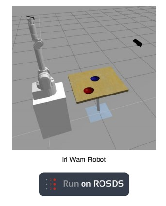

# Блок 4. Services в ROS. Часть 1

**ROS 2 ОСНОВЫ ЗА 5 ДНЕЙ**

**Cpp service в ROS 2 Часть 1**



Ссылка на проект: [https://bit.ly/2FPf3tR](https://bit.ly/2FPf3tR)

Робот: **WAM Arm**

Время до завершения: 2,5 часа. Чему вы научитесь с помощью этого устройства?

* Что такое ****service
* Как создать service server
* Как создать service client
* Как вызвать service

## Часть 1

Поздравляем! Теперь вы знаете 75% основ ROS! С topics, вы можете увеличивать или уменьшать все, что вы хотите и нужно для вашего астромеханического дроида. Многие пакеты ROS используют только topics, и все работает отлично. Тогда зачем нужно узнавать об services? Все потому, что в некоторых случаях topics являются недостаточными или слишком громоздкими для использования. Конечно, можно уничтожить Звезду Смерти палкой, но вы потратите на это целую вечность. Лучше сказать Люку Скайвокеру сделать это за вас, верно? Ну, то же самое с services. Они просто облегчают жизнь

**Topics - Services - Actions**

Чтобы понять, что такое services и когда их следует использовать, вы должны сравнить их с topics и actions. Представьте, что у вас есть свой личный робот BB-8. Он имеет лазерный датчик, систему распознавания лиц и навигационную систему. Лазер будет использовать topic для публикаций всех своих показаний на частоте 20 Гц. Мы используем topic, потому что нам нужно, чтобы эта информация была доступна все время для других систем ROS, таких как навигационная система. Система распознавания лиц будет предоставлять service. Ваша программа ROS вызовет эту service и будет ждать, пока она не даст вам имя человека, которого видит перед собой BB-8. Навигационная система обеспечит actions. Ваша ROS программа вызовет actions, чтобы переместить робота куда-то, и пока он выполняет эту задачу, ваша программа будет выполнять и другие задачи, например жаловаться на усталость C-3PO. И это же actions даст вам обратную связь \(например: расстояние до нужных координат\), как робот движется в направлении координат.

Так. . . в чем разница между service и action? Service работают синхронно. Когда ROS вызывает service, ваша программа не сможет продолжать работу, пока не получит результат от service. Action являются асинхронными. Это все равно что запустить новую нить. Когда ROS вызывает action, ваша программа может делать другие задачи во время выполнения action в другом потоке.

Вывод: используйте service, когда ваша программа не может продолжать работу до тех пор, пока не получит результат от service.

**ROS 2 и примеры services.**

Мы увидим, как использовать команды для **ROS2 Service**.


Мы также пройдем шаг за шагом через создание **Service Server** и **Service Client** для **ROS 2**.

Мы сделаем следующее:

* Просмотрим различные команды для ROS2 services.
* Расскажем об ограничениях ROS1-Bridge и о том, как их обойти.
* Вызовем команду Robot service, чтобы удалить модель в ROS 2
* Создадим dummy-Service-Server для ROS2.
* Создадим client для dummy\_Service-Server для ROS2, чтобы удалить модель.
* Изменим client для dummy\_Service-Server f для ROS2, чтобы вызвать real Robot service для удаления модели.

**Получение структуры service сообщений и команд:**

ROS 2, на момент создания этого учебника, поддерживает следующие команды для services и их сообщений:

* **ros2 service list**: содержит список всех services, запущенных в настоящее время в системе 
* **ros2 service call:** вызов определенного service, доступного в данный момент 
* **ros2 srv list:** список всех доступных service сообщений 
* **ros2 srv package:** перечисляет все service сообщения из пакета 
* **ros2 srv packages:** перечисляет все доступные пакеты, внутри которых определены service сообщения 
* **ros2 srv show:** получает структуру определенного service сообщения

Предупреждение: в настоящее время нет поддержки команды ROS2 service info которая была в ROS 1.

**ROS2 service list**

Выполнение программы \#1 

Помните, что всякий раз, когда вы взаимодействуете с ROS1, вам нужно запустить **ROS1-Bridge**.

```text
[ ]: . /home/user/.bashrc_bridge
        export ROS_MASTER_URI=http://localhost:11311
        ros2 run ros1_bridge dynamic_bridge
```

Выполнение программы \#2 

С помощью этой команды вы можете запустить все services прямо сейчас. В этом случае большинство из них будет связано это с ROS1-Gazebo.

```text
[ ]: # Get all the services currently running
    . /home/user/.bashrc_ros2
      ros2 service list
```

Вывод программы \#2

```text
[ ]: /camera/set_camera_info
     /gazebo/pause_physics
     /gazebo/reset_simulation
     /gazebo/reset_world
     /gazebo/unpause_physics
     /ros_bridge/describe_parameters
     /ros_bridge/get_parameter_types
     /ros_bridge/get_parameters
     /ros_bridge/list_parameters
     /ros_bridge/set_parameters
     /ros_bridge/set_parameters_atomically
```

Ограничения ROS 1- Bridge и как их обойти 

Здесь возникает очень важная тема: поддержка ROS1-Bridge debians для service сообщений. На данный момент не все сообщения поддерживаются. Это означает, что, хотя оба типа сообщений установлены как в **melodic ROS1**, так и в **crystal ROS2**, поскольку ROS1-Bridge не был скомпилирован с этими сообщениями, он не сможет их соединить!

Хороший способ увидеть, поддерживает ли ROS1-Bridge эту service - это список services, предоставленных в начале. В этом случае вы можете видеть, что поддерживаются только они:

```text
[ ]: /camera/set_camera_info
     /gazebo/pause_physics
     /gazebo/reset_simulation
     /gazebo/reset_world
     /gazebo/unpause_physics
```

Это происходит потому, что это единственные службы в Gazebo для ROS1, которые не используют service сообщения типа **gazebo\_msgs**. 

Например, давайте проверим тип сообщения, используемого в service **/gazebo/delete\_model** в **ROS1**

Выполнение программы \#3

```text
[ ]: . /home/user/.bashrc_ros1
        rosservice info /gazebo/delete_model
```

Вывод программы \#3

```text
[ ]: Node: /gazebo
      URI: rosrpc://10.8.0.1:35755
      Type: gazebo_msgs/DeleteModel
      Args: model_name
```

Вот почему ROS1-Bridge не находит его, и вы не сможете ничего отправить в этот service из ROS2 в ROS1.

Итак, в этом сценарии у вас есть три варианта:

* Вы компилируете ROS1-Bridge из исходного кода с новыми сообщениями в той же рабочей области. Но мы не будем говорить об этом в этом базовом курсе.
* Вы используете всю систему ROS 2, не нуждаясь в ROS1-Bridge. Мы сделаем это в роботе MARA.
* Вы создаете Bridge Services, которые создаются и запускаются в ROS1, и используете поддерживаемые сообщения ROS1-Bridge; в этом случае std\_srvs. Этот servis сможет взаимодействовать с ROS2 через ROS1-Bridge, а затем выполнить эквивалентное действие в пространстве ROS1. Это то, что мы собираемся сделать в этом курсе.

Давайте рассмотрим пример:

**ROS2 service call**

Мы хотим вызвать service **ROS1 Gazebo** для удаления объекта. Поскольку это **ROS1 Gazebo**, нам нужен **ROS1-Bridge** для взаимодействия с ним.

```text
[ ]: ros2 service call /gazebo/delete_model gazebo_msgs/DeleteModel
      '{model_name: TestingName}'
```

Выполнение программы \#1 

Помните, что всякий раз, когда вы взаимодействуете с **ROS1**, вам нужно запустить **ROS1-Bridge**.

```text
[ ]: . /home/user/.bashrc_bridge
       export ROS_MASTER_URI=http://localhost:11311
       ros2 run ros1_bridge dynamic_bridge
```

Выполнение программы \#2

```text
[ ]: # Call A Service Server
      . /home/user/.bashrc_ros2
      ros2 service call /gazebo/delete_model gazebo_msgs/DeleteModel
      '{model_name: bowl_1}'
```

Обратите внимание, что вы должны оставить пробел между “:” и именем. Для получения дополнительной информации, пожалуйста, ознакомьтесь с командной строкой YAML из документации ROS о том, как заполнять вызовы для различных сообщений. Это происходит потому, что в ROS2, на момент создания этого курса, он не поддерживал автозаполнение служебных сообщений в методе вызова в командной строке. 

Вывод программы \#2

```text
[ ]: waiting for service to become available...
```

Как видите, ничего не происходит. Это потому, что этот topic НЕ находится в пространстве ROS2, из-за ограничений, упомянутых о **ROS1-Bridge**. Поэтому вам придется создать **Bridge-Service** в ROS1.

Если вы не знаете основы **ROS1**, мы рекомендуем пройти курс **ROS за пять дней с курсом CPP**, прежде чем переходить к следующему шагу.

Выполнение программы \#3 ROS1

```text
[ ]: . /home/user/.bashrc_ros1
        cd ~/catkin_ws/src
        catkin_create_pkg my_bridge_ros1_pkgs roscpp std_srvs
        touch my_bridge_ros1_pkgs/src/bridge_delete_model_server.cpp
        cd ~/catkin_ws
        catkin_make
        source devel/setup.bash
        rospack profile
```

Мы создаем следующие файлы и компилируем их: 

**C++ Program {3.1}: bridge\_delete\_model\_server.cpp**

```text
[ ]: #include <ros/ros.h>
      #include "gazebo_msgs/DeleteModel.h"
      #include <std_srvs/Empty.h>
      class BridgeDeleteModelServer
      {
         private:
                // ROS Объект
                 ros::NodeHandle nh_;
                // ROS Services
                ros::ServiceServer srv_perform_square_;
                 ros::ServiceServer bridge_delete_model_service_server_;
                 ros::ServiceClient delete_model_service_client_;
   public:
 BridgeDeleteModelServer()
{
          ROS_INFO("Creating Service...");
           // Создайте вызываемый Service
           this->bridge_delete_model_service_server_ = nh_.advertiseService("/my_bridge_delete_model",
                   &BridgeDeleteModelServer::my_callback,
            this);
         this->delete_model_service_client_ =
                nh_.serviceClient<gazebo_msgs::DeleteModel>("/gazebo/delete_model");
                ROS_INFO("Creating Service...DONE");
}
~BridgeDeleteModelServer(void)
{
}
bool my_callback(std_srvs::Empty::Request &req,
std_srvs::Empty::Response &res)
{
// Создание объекта типа DeleteModel
gazebo_msgs::DeleteModel srv;
// Заполните переменную model_name этого объекта следующим образом
desired value
srv.request.model_name = "bowl_1";
// Отправьте через соединение название объекта, который будет удален service
       if (delete_model_service_client_.call(srv))
{
     // Выведите результат, полученный вызванной службой
       ROS_INFO("%s", srv.response.status_message.c_str());
       return true;
}
else
{
         ROS_ERROR("Failed to call service delete_model");
return false;
}
  }
};
int main(int argc, char** argv)
{
     ros::init(argc, argv, "bridge_delete_model_server_node");
     BridgeDeleteModelServer bridge_delete;
     ros::spin();
     return 0;
}

```

Единственная строка, которая должна вас беспокоить здесь, - это та, где мы указываем, что модель должна быть удалена:

```text
[ ]: srv.request.model_name = "bowl_1";
```

И измените **CMakelists.txt** и **package.xml** 

Файл **CMake {3.1}: CMakelists.txt**

```text
[ ]: cmake_minimum_required(VERSION 2.8.3)
      project(my_bridge_ros1_pkgs)
      ## Compile as C++11, supported in ROS Kinetic and newer
      # add_compile_options(-std=c++11)
      ## Find catkin macros and libraries
      ## if COMPONENTS list like find_package(catkin REQUIRED COMPONENTS
xyz)
     ## is used, also find other catkin packages
     find_package(catkin REQUIRED COMPONENTS
      roscpp
      std_srvs
      gazebo_msgs
)
catkin_package(
      # INCLUDE_DIRS include
      # LIBRARIES my_bridge_ros1_pkgs
)
include_directories(
      # include
      ${catkin_INCLUDE_DIRS}
)
add_executable(bridge_delete_model_server_node
src/bridge_delete_model_server.cpp)
add_dependencies(bridge_delete_model_server_node
${bridge_delete_model_server_node_EXPORTED_TARGETS}
${catkin_EXPORTED_TARGETS})
target_link_libraries(bridge_delete_model_server_node
     ${catkin_LIBRARIES}
)
```

**XML File {3.1}: package.xml**

```text
[ ]: <?xml version="1.0"?>
      <package format="2">
          <name>my_bridge_ros1_pkgs</name>
          <version>0.0.0</version>
          <description>The my_bridge_ros1_pkgs package</description>
          <maintainer email="user@todo.todo">user</maintainer>
          <license>TODO</license>

          <buildtool_depend>catkin</buildtool_depend>
          <build_depend>roscpp</build_depend>
          <build_depend>std_srvs</build_depend>
          <build_depend>gazebo_msgs</build_depend>
          <build_export_depend>roscpp</build_export_depend>
          <build_export_depend>std_srvs</build_export_depend>
          <build_export_depend>gazebo_msgs</build_export_depend>
          <exec_depend>roscpp</exec_depend>
         <exec_depend>std_srvs</exec_depend>
         <exec_depend>gazebo_msgs</exec_depend>

         <!-- The export tag contains other, unspecified, tags -->
         <export>
         <!-- Other tools can request additional information be placed here
        -->

</export>
</package>
```

Выполнение программы \#3 ROS1 

Мы составляем новую программу:

```text
[ ]: . /home/user/.bashrc_ros1
      cd ~/catkin_ws
      catkin_make
      source devel/setup.bash
      rospack profile
```

Хорошо, теперь, когда у нас есть все части, чтобы сделать эту работу, давайте вернемся и запустим все в соответствующие веб-оболочки:

Выполнение программы \#1

Помните, что всякий раз, когда вы взаимодействуете с ROS1, вам нужно запустить **ROS1-Bridge**.

```text
[ ]: . /home/user/.bashrc_bridge
       export ROS_MASTER_URI=http://localhost:11311
       ros2 run ros1_bridge dynamic_bridge
```

Выполнить в программе \#3 ROS1 service, который мы создали в ROS1.

```text
[ ]: . /home/user/.bashrc_ros1
      rosrun my_bridge_ros1_pkgs bridge_delete_model_server_node
```

Выполнение программы \#2

```text
[ ]: # We check that the bridge service is now available for ROS2 space
      . /home/user/.bashrc_ros2
      ros2 service list | grep /my_bridge_delete_model
```

Вывод программы \# 2: ROS2

```text
[ ]: /my_bridge_delete_model
```

Если вы получили название темы в выходных данных, /my\_bridge\_delete\_model, то все прошло нормально, и теперь вы можете перейти к вызову этой service и удалить модель bowl\_1 из сцены с ROS2.

Выполнение программы \#2 ROS2

```text
[ ]: # Call A Service Server
      . /home/user/.bashrc_ros2
     ros2 service call /my_bridge_delete_model std_srvs/Empty '{}'
```

Вывод программы \# 2: ROS2

```text
[ ]: requester: making request: std_srvs.srv.Empty_Request()
      response:
      std_srvs.srv.Empty_Response()
```

Теперь вы должны увидеть в симуляторе, как bowl\_1 удаляется из сцены. Если вы хотите сбросить окружающую среду, просто перейдите на другой модуль, который имеет другую симуляцию, и вернитесь к этому, чтобы сбросить всю среду моделирования.

###                                                     **Чаши**


**ROS2 srv list**

**Предупреждение:** не смешивайтесь с командой **ros2 service list**. Здесь мы **НЕ** перечисляем services, доступные в настоящее время и работающие в системе ROS 2. Здесь мы перечислим service сообщения, доступные для использования в ROS 2.

Выполнение программы \#2 

Обратите внимание, что в следующих командах bridge не нужен, потому что он предназначен только для информации о сообщениях и системе ROS2 в целом.

```text
[ ]: # List all available service messages in the system
     . /home/user/.bashrc_ros2
     ros2 srv list
```

Вывод программы \#2

```text
[ ]: ...
      rcl_interfaces/GetParameters
      rcl_interfaces/ListParameters
      rcl_interfaces/SetParameters
      rcl_interfaces/SetParametersAtomically
      sensor_msgs/SetCameraInfo
      std_srvs/Empty
      std_srvs/SetBool
      std_srvs/Trigger
      tf2_msgs/FrameGraph
      ...
```

Как вы можете видеть в доступных типах сообщений, вы **МОЖЕТЕ** использовать **Gazebo\_msgs**, но это не означает, что debian из **ROS2 bridge** может использовать их, потому что он должен быть скомпилирован по сравнению с этими сообщениями, что, похоже, не так.

**ROS2 srv package gazebo\_msgs**

```text
[ ]: # List all the messages defined in a certain package
     . /home/user/.bashrc_ros2
     ros2 srv package gazebo_msgs
```

Вывод программы \#2

```text
[ ]: gazebo_msgs/ApplyBodyWrench
     gazebo_msgs/ApplyJointEffort
     gazebo_msgs/BodyRequest
     gazebo_msgs/DeleteEntity
     gazebo_msgs/DeleteLight
     gazebo_msgs/DeleteModel
     gazebo_msgs/GetJointProperties
     gazebo_msgs/GetLightProperties
     gazebo_msgs/GetLinkProperties
     gazebo_msgs/GetLinkState
     gazebo_msgs/GetModelProperties
     gazebo_msgs/GetModelState
     gazebo_msgs/GetPhysicsProperties
     gazebo_msgs/GetWorldProperties
     gazebo_msgs/JointRequest
     gazebo_msgs/SetJointProperties
     gazebo_msgs/SetJointTrajectory
     gazebo_msgs/SetLightProperties
     gazebo_msgs/SetLinkProperties
     gazebo_msgs/SetLinkState
     gazebo_msgs/SetModelConfiguration
     gazebo_msgs/SetModelState
     gazebo_msgs/SetPhysicsProperties
     gazebo_msgs/SpawnEntity
     gazebo_msgs/SpawnModel
```

Выполнение программы \#2

```text
[ ]: # List all the packages that have Service Messages defined in them
      . /home/user/.bashrc_ros2
      ros2 srv packages
```

Вывод программы \#2

```text
[ ]: composition
      diagnostic_msgs
      example_interfaces
      gazebo_msgs
      lifecycle_msgs
      logging_demo
      map_msgs
      nav_msgs
      rcl_interfaces
      sensor_msgs
      std_srvs
      tf2_msgs
      unit_3_services_custom_msgs
```

Выполнение программы \#2

```text
[ ]: # List all the messages defined in a certain package
      . /home/user/.bashrc_ros2
     ros2 srv show gazebo_msgs/DeleteModel
```

Вывод программы \#2

```text
[ ]: string model_name            # name of the Gazebo Model to be
      deleted
      ---
      bool success                # return true if deletion is
      successful
      string status_message       # comments if available
```

И здесь мы можем представить структуру service сообщений. Этот вывод для сообщения **DeleteModel** кажется знакомым? Это следует сделать, потому что это та же структура, что и в сообщениях Topics, с некоторыми дополнениями.

**Свойства Service Сообщения:**

* Service сообщения имеют расширение .srv. Помните, что Topic сообщения имеют расширение .msg
* Service сообщения определяются в каталоге srv, а не в каталоге msg.
* Service сообщения состоят из двух частей:

REQUEST\( ЗАПРОС\) 

**---**

RESPONSE \(ОТВЕТ\)

В случае service DeleteModel **REQUEST** содержит строку с именем **model\_name**, а **RESPONSE** состоит из логического имени с именем **success** и строки с именем **status\_message**. Количество элементов в каждой части сообщения service может варьироваться в зависимости от потребностей service. Вы не cможете поставить ни один из них, если вы обнаружите, что это не имеет значения для вашего service. Важной частью сообщения являются три черточки, потому что они определяют файл как service сообщение. 

Подведение:

**REQUEST** является частью service сообщения, которое определяет **КАК** вы будете обращаться в ваш service. Это означает, что переменные вам нужно будет передать на **Service Server**, чтобы он мог выполнить свою задачу.

**RESPONSE** - это часть service сообщения, которая определяет, как service будет реагировать после завершения своей функциональности. Например, он вернет строку с определенным сообщением о том, что все прошло хорошо, или ничего не вернет и т. д. … 

Пример 3.1

**Создание cpp\_unit\_3\_services package** 

Сначала мы создаем пакет, в котором будем сохранять все service коды и упражнения. 

Выполнение программы \#1

```text
[ ]: . /home/user/.bashrc_ros2
        cd ~/ros2_ws/src
        ros2 pkg create cpp_unit_3_services --build-type ament_cmake
        --dependencies std_msgs rclcpp gazebo_msgs
```

Вывод программы \#1

```text
[ ]: going to create a new package
     package name: cpp_unit_3_services
     destination directory: /home/user/ros2_ws/src
     package format: 2
     version: 0.0.0
     description: TODO: Package description
     maintainer: ['user <user@todo.todo>']
     licenses: ['TODO: License declaration']
     build type: ament_cmake
     dependencies: ['std_msgs', 'rclcpp', 'gazebo_msgs']
     creating folder ./cpp_unit_3_services
     creating ./cpp_unit_3_services/package.xml
     creating source and include folder
     creating folder ./cpp_unit_3_services/src
     creating folder ./cpp_unit_3_services/include/cpp_unit_3_services
     creating ./cpp_unit_3_services/CMakeLists.txt
```

А теперь мы компилируем. 

Выполнение программы \#1

```text
[ ]: . /home/user/.bashrc_ros2
      cd ~/ros2_ws
      # Compile all workspace
      # colcon build --symlink-install
      # Compile only the package we have created 
      colcon build --symlink-install --packages-select cpp_unit_3_services
```

Вывод программы \#1

```text
[ ]: Starting >>> cpp_unit_3_services
       Finished <<< cpp_unit_3_services [2.54s]

      Summary: 1 package finished [2.73s]
```

**Создание Service Client и Dummy Server**

Давайте теперь узнаем, как обратиться и предоставить service в ROS2. Начнем с dummy Server. 

Выполнение программы \#1

```text
[ ]: cd ~/ros2_ws/src/cpp_unit_3_services
      touch src/cpp_simple_service_client.cpp
```

**C++ Program {3.2}: cpp\_simple\_service\_client.cpp**

Обратите внимание, что если исходное имя service сообщения было **DeleteModel.srv**, сгенерированный файл **hpp** для сообщения будут называться **delete\_model.hpp**. Если бы у вас был **MyCustomService.srv**, это было бы бы **my\_custom\_service.hpp** и так далее.

```text
[ ]: #include <chrono>
     #include <cinttypes>
     #include <iostream>
     #include <memory>
     #include <string>
     #include "rclcpp/rclcpp.hpp"
     #include "gazebo_msgs/srv/delete_model.hpp"

      gazebo_msgs::srv::DeleteModel::Response::SharedPtr send_request(
        rclcpp::Node::SharedPtr node,
        rclcpp::Client<gazebo_msgs::srv::DeleteModel>::SharedPtr client,
     gazebo_msgs::srv::DeleteModel::Request::SharedPtr request)
    {

      auto result = client->async_send_request(request);
       // Ждите результата.
       if (rclcpp::spin_until_future_complete(node, result) ==
       rclcpp::executor::FutureReturnCode::SUCCESS)
   {
     RCLCPP_INFO(node->get_logger(), "Client request->model_name : %s",
     request->model_name.c_str());
     return result.get();
    } 
   else
   {
     RCLCPP_ERROR(node->get_logger(), "service call failed :(");
return NULL;
    }
 }
 int main(int argc, char ** argv)
 {
  // Принудительная очистка буфера stdout.
  setvbuf(stdout, NULL, _IONBF, BUFSIZ);
  rclcpp::init(argc, argv);
  auto node =
  rclcpp::Node::make_shared("cpp_simple_service_client");

   auto topic = std::string("/gazebo/delete_model");
   auto client =
   node->create_client<gazebo_msgs::srv::DeleteModel>(topic);
   auto request =
   std::make_shared<gazebo_msgs::srv::DeleteModel::Request>();
// Заполните переменную model_name этого объекта желаемым значением
   value
   request->model_name = "bowl_1";
   while (!client->wait_for_service(std::chrono::seconds(1))) {
   if (!rclcpp::ok()) {
   RCLCPP_ERROR(node->get_logger(), "Interrupted while waiting for
   the service. Exiting.");
   return 0;
   }
   RCLCPP_INFO(node->get_logger(), "service not available, waiting
   again...");
 }
auto result = send_request(node, client, request);
if (result)
{
   auto result_str = result->success ? "True" : "False";
   RCLCPP_INFO(node->get_logger(), "Result-Success : %s", result_str);
   RCLCPP_INFO(node->get_logger(), "Result-Status: %s", result->status_message.c_str());
 } else {
    RCLCPP_ERROR(node->get_logger(), "Interrupted while waiting for response. Exiting.");
 }
 rclcpp::shutdown();
return 0;
}

```

Выполнение программы \#1

```text
[ ]: cd ~/ros2_ws/src/cpp_unit_3_services
      touch src/cpp_simple_service_dummy_server.cpp
```

**C++ Program {3.4}: cpp\_simple\_service\_dummy\_server.cpp**

```text
[ ]: #include <inttypes.h>
     #include <memory>
     #include "rclcpp/rclcpp.hpp"
     #include "gazebo_msgs/srv/delete_model.hpp"
     using DeleteModel = gazebo_msgs::srv::DeleteModel;
     rclcpp::Node::SharedPtr g_node = nullptr;
     void handle_service(
          const std::shared_ptr<rmw_request_id_t> request_header,
          const std::shared_ptr<DeleteModel::Request> request,
          const std::shared_ptr<DeleteModel::Response> response)
  {
         (void)request_header;
         RCLCPP_INFO(
         g_node->get_logger(),
        "Incoming request\nModel-To_Delete-Name: %s", request->model_name.c_str());
         response->success = true;
         response->status_message = "The Model "+request->model_name+" was deleted.";
}
int main(int argc, char ** argv)
{
         rclcpp::init(argc, argv);
         g_node = rclcpp::Node::make_shared("cpp_simple_service_server");
         auto server =
         g_node->create_service<DeleteModel>("/gazebo/delete_model", handle_service);
         rclcpp::spin(g_node);
         rclcpp::shutdown();
         g_node = nullptr;
         return 0;
}
```

**cpp\_simple\_service\_dummy\_server.cpp**

Теперь мы вносим необходимые изменения в списки **CMakeLists.txt** для компиляции **client** и **dummy\_server** и установки их в вашем рабочем пространстве. 

**Setup {3.4}: CMakeLists.txt**

```text
[ ]: cmake_minimum_required(VERSION 3.5)
       project(cpp_unit_3_services)

       # Default to C99
       if(NOT CMAKE_C_STANDARD)
        set(CMAKE_C_STANDARD 99)
        endif()

        # Default to C++14
        if(NOT CMAKE_CXX_STANDARD)
        set(CMAKE_CXX_STANDARD 14)
        endif()

        if(CMAKE_COMPILER_IS_GNUCXX OR CMAKE_CXX_COMPILER_ID MATCHES "Clang")
       add_compile_options(-Wall -Wextra -Wpedantic)
      endif()

         # find dependencies
         find_package(ament_cmake REQUIRED)
         find_package(std_msgs REQUIRED)
         find_package(rclcpp REQUIRED)
         find_package(gazebo_msgs REQUIRED)

         if(BUILD_TESTING)
             find_package(ament_lint_auto REQUIRED)
             # the following line skips the linter which checks for copyrights
             # remove the line when a copyright and license is present in all 
  source files
             set(ament_cmake_copyright_FOUND TRUE)
             # the following line skips cpplint (only works in a git repo)
             # remove the line when this package is a git repo
             set(ament_cmake_cpplint_FOUND TRUE)
            ament_lint_auto_find_test_dependencies()
       endif()

       function(custom_executable target)
         add_executable(${target}_node src/${target}.cpp)
         ament_target_dependencies(${target}_node
             "gazebo_msgs"
            "rclcpp"
            "std_msgs")
       Install(TARGETS ${target}_node
       DESTINATION lib/${PROJECT_NAME})
       endfunction()

# Adding Services
custom_executable(cpp_simple_service_client)
custom_executable(cpp_simple_service_dummy_server)

ament_package()
```

А теперь мы скомпилируем все рабочее пространство: 

Выполнение программы \#2

```text
[ ]: . /home/user/.bashrc_ros2
       cd ~/ros2_ws

      # We compile everythin in the ws except the packages we dont want.
      colcon build --symlink-install --packages-skip
      NAME_OF_NONCOMPILE_PACKAGE

       # Or compile only the package when you do changes:
       colcon build --symlink-install --packages-select cpp_unit_3_services
```


Выполнение программы \#2

```text
[ ]: # Check that your Client And server binaries were generated
      ll ~/ros2_ws/install/cpp_unit_3_services/lib/cpp_unit_3_services/cpp_s
      imple_service_client_node
      ll ~/ros2_ws/install/cpp_unit_3_services/lib/cpp_unit_3_services/cpp_s
      imple_service_dummy_server_node
```

Вывод программы \#1

```text
[ ]: lrwxrwxrwx 1 user user 75 Dec 19 18:32 /home/user/ros2_ws/install/cpp_
      unit_3_services/lib/cpp_unit_3_services/cpp_simple_service_client_node
      -> /home/user/ros2_ws/build/cpp_unit_3_services/cpp_simple_service_client_node*
      lrwxrwxrwx 1 user user 81 Dec 19 18:32 /home/user/ros2_ws/install/cpp_
      unit_3_services/lib/cpp_unit_3_services/cpp_simple_service_dummy_serve
      r_node ->/home/user/ros2_ws/build/cpp_unit_3_services/cpp_simple_serv
      ice_dummy_server_node*
```

Как видите, исполняемые файлы, которые будут запускаться, являются программными ссылками на сборку двоичных файлов, которая находится в папке сборки. Помните, что мы всегда будем выполнять элементы установки, а не сборку напрямую. 

А теперь мы компилируем:

Теперь давайте выполним оба **client/dummy-server**, чтобы проверить, что они работают: 

Выполнение программы \#2: ROS2 Service CLIENT

В настоящее время в ROS2 не всегда работает завершение **DoubleTab**, но в этом случае вы можете использовать его для автоматического завершения и проверки того, что система правильно находит путь к исполняемому файлу.

```text
[ ]: . /home/user/.bashrc_ros2
       ros2 run cpp_unit_3_services cpp_simple_service_client_node
```

Выполнение программы \#3: ROS2 Service Server Dummy

```text
[ ]: . /home/user/.bashrc_ros2
        ros2 run cpp_unit_3_services cpp_simple_service_dummy_server_node
```

Вывод программы \#1

```text
[ ]: [INFO] [cpp_simple_service_client]: service not available, waiting again...
     [INFO] [cpp_simple_service_client]: service not available, waiting again...
     [[INFO] [cpp_simple_service_client]: Client request->model_name : bowl_1
     [INFO] [cpp_simple_service_client]: Result-Success : True
     [INFO] [cpp_simple_service_client]: Result-Status: The Model bowl_1 was deleted.
```

Service недоступен, поэтому он будет запрашиваться в течение всего времени, пока вы не запустите server вывод программы \#2.

```text
[ ]: [INFO] [cpp_simple_service_server]: Incoming request Model-To_Delete-Name: bowl_1
```


**Упражнение 3.1**

Отлично, теперь пришло время проверить его в реальной симуляции. Для этого нам придется повторно использовать программу, которую мы сделали, чтобы иметь возможность общаться через стандартные services по причинам, упомянутым тогда. Итак, вам придется сделать две вещи:

* Измените имя службы, к которой необходимо подключиться в разделе cpp\_simple\_service\_client\_node
* Измените тип используемых служебных сообщений, поскольку помните, что service использует сообщения std\_srvs / Empty.srv.
* Измените модель для удаления в bridge\_delete\_model\_server.cpp и перекомпилируйте в ROS1.

```text
[ ]: service_name = '/dummy_gazebo/delete_model' --> service_name =
      '/my_bridge_delete_model'
      service_message_type = 'gazebo_msgs/DeleteModel.srv' -->
      service_message_type = 'std_srvs/Empty.srv'
      Model to remove now --> "cafe_table"
```

Выполнение программы \#1 

Помните, что всякий раз, когда вы взаимодействуете с ROS1, вам нужно запустить ROS1-Bridge.

```text
[ ]: . /home/user/.bashrc_bridge
      export ROS_MASTER_URI=http://localhost:11311
      ros2 run ros1_bridge dynamic_bridge
```

Выполнить в программе \#2 ROS1 Service, который мы создали в ROS1.

```text
[ ]: . /home/user/.bashrc_ros1
      rosrun my_bridge_ros1_pkgs bridge_delete_model_server_node
```

Выполнение программы \#3

```text
[ ]: . /home/user/.bashrc_ros2
      ros2 run cpp_unit_3_services cpp_simple_service_client_ex3_1_node
```


\#\#

Решения

Пожалуйста, попробуйте сделать это самостоятельно, если вы не застряли или не нуждаетесь в вдохновении. Вы узнаете гораздо больше, если будете бороться каждое упражнение. 

Перейдите по этой ссылке, чтобы открыть решения для Services Part 1: Cpp Services Part 1 Solution


Теперь давайте создадим файл запуска, чтобы сделать то же самое, что вы делали в упражнении 3.1:

Выполнение программы \#1

```text
[ ]: cd ~/ros2_ws/src/cpp_unit_3_services
      mkdir launch
      touch launch/start_cpp_simple_service_client_ex3_1.cpp.launch.py
      chmod +x launch/start_cpp_simple_service_client_ex3_1.cpp.launch.py
```

**C++ Program {3.5}: start\_ cpp\_simple\_service\_client\_ex3\_1.cpp.launch.py**

```text
[ ]: """Launch cpp_simple_service_client_node_ex3_1"""

      from launch import LaunchDescription
      import launch_ros.actions

      def generate_launch_description():
        return LaunchDescription([
          launch_ros.actions.Node(
            package='cpp_unit_3_services',
       node_executable='cpp_simple_service_client_ex3_1_node',
       output='screen'),
      ])
```

**cpp\_simple\_service\_client\_ex3\_1.cpp.launch.py**

И добавьте следующую строку в CMakelists.txt:

```text
[ ]: # Install launch files.
       install(DIRECTORY
       launch
       DESTINATION share/${PROJECT_NAME}/
       )
```

Теперь мы компилируем и выполняем:

Выполнение программы \#1 

Помните, что всякий раз, когда вы взаимодействуете с ROS1, вам нужно запустить ROS1-Bridge.

```text
[ ]: . /home/user/.bashrc_bridge
      export ROS_MASTER_URI=http://localhost:11311
      ros2 run ros1_bridge dynamic_bridge
```

Выполнить в программе \# 2 ROS1 Service, который мы создали в ROS1.

```text
[ ]: . /home/user/.bashrc_ros1
      rosrun my_bridge_ros1_pkgs bridge_delete_model_server_node
```

Выполнение программы \#3

```text
[ ]: . /home/user/.bashrc_ros2
     cd ~/ros2_ws
     colcon build --symlink-install --packages-select cpp_unit_3_services
     ros2 launch cpp_unit_3_services
     start_cpp_simple_service_client_ex3_1.cpp.launch.py
```

Вывод программы \#3

```text
[ ]: [INFO] [launch]: process[cpp_simple_service_client_ex3_1_node-1]:
      started with pid [25863]
     [INFO] [cpp_simple_service_client_ex3_1]: service not available,
      waiting again...
     [INFO] [cpp_simple_service_client_ex3_1]: service not available,
      waiting again...
     [INFO] [cpp_simple_service_client_ex3_1]: Client Requested to remove
      model.
     [INFO] [cpp_simple_service_client_ex3_1]: Result-Success.
     [INFO] [launch]: process[cpp_simple_service_client_ex3_1_node-1]:
     process has finished cleanly

```

Но не слишком увлекайтесь удалением объектов, иначе вы останетесь без робота.


