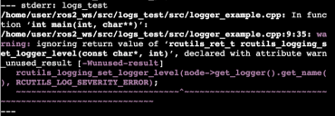

# Блок 5. Средства отладки

**ROS2 ОСНОВЫ ЗА 5 ДНЕЙ**

**Блок 5. Средства отладки**


Ссылка на проект: [https://bit.ly/2Be6B3x](https://bit.ly/2Be6B3x)

Робот: **MARA**

**Примечание:** Вы найдете инструкции о том, как запустить эту симуляцию в блокноте Jupyter проекта.

Время до завершения: 1,5 часа. Чему вы научитесь с помощью этого устройства?

* Добавление журналов отладки ROS 
* Основное использование инструмента отладки RViz2

Одна из самых сложных, но важных частей робототехники - это знание того, как превратить свои идеи и знания в реальные проекты. В робототехнических проектах есть правило: ничто не работает так, как в теории. Реальность гораздо сложнее, и поэтому вам нужны инструменты, чтобы узнать, что происходит, и найти, где находится проблема. Вот почему инструменты отладки и визуализации необходимы в робототехнике, особенно при работе со сложными форматами данных, такими как изображения, лазерные сканы, точечные облака или кинематические данные. Примеры приведены в {рис. 5.1} и {рис.5.2}.


Итак, здесь вам будут представлены самые важные инструменты для отладки вашего кода и визуализации того, что на самом деле происходит в вашей роботизированной системе.

**Сообщения об отладке ROS**

Журналы позволяют печатать их на экране, но также хранить их в рамках ROS, так что вы можете классифицировать, сортировать, фильтровать или что-то еще. 

В системах ведения журналов всегда существуют уровни ведения журнала, как показано на {Рис.5.1}. В случае журналов ROS2 существует пять уровней. Каждый уровень включает в себя более глубокие уровни. Так, например, если вы используете уровень ошибок, будут показаны все сообщения об ошибках и фатальных. Если ваш уровень - «Warn», то будут показаны все сообщения для уровней «Warn», «Error» и «Fatal».


DEBUG --&gt; RCLCPP\_DEBUG \(это журнал отладки\); 

INFO--&gt; RCLCPP\_INFO \(это информационный журнал\); 

WARNING --&gt; RCLCPP\_WARN \(это журнал предупреждений\); 

ERROR--&gt;RCLCPP\_ERROR \(это журнал ошибок\); 

FATAL--&gt;RCLCPP\_FATALI \(это фатальный журнал\).

Выполните следующий код C++ : 

**Упражнение 5.1**

* Создайте новый пакет с именем logs\_test. При создании пакета добавьте rclcpp в качестве зависимостей. 
* Внутри папки src пакета создайте новый файл с именем logger\_example.cpp. Внутри этого файла скопируйте содержимое logger\_example.cpp. 
* Создайте файл запуска для запуска этого кода. 
* Сделайте необходимые изменения в ваших CMakeLists.txt файл и скомпилируйте пакет. 
* Запустите загрузочный файл, чтобы запустить исполняемый файл.

**C++ Program {5.1}: logger\_example.cpp**

```text
[ ]: #include "rclcpp/rclcpp.hpp"

      int main(int argc, char * argv[])
      {
            rclcpp::init(argc, argv);
            auto node = rclcpp::Node::make_shared("log_demo");
            rclcpp::WallRate loop_rate(0.5);
            rcutils_logging_set_logger_level(node->get_logger().get_name(),
      RCUTILS_LOG_SEVERITY_DEBUG);
            while (rclcpp::ok()) {

                RCLCPP_DEBUG(node->get_logger(), "There is a missing droid");
                RCLCPP_INFO(node->get_logger(), "The Emperor's cappuccino is
     done");
                RCLCPP_WARN(node->get_logger(), "Help me Obi-Wan Kenobi, you're my
     only hope");
                RCLCPP_ERROR(node->get_logger(), "The rebels are breaking our
     defenses");
                 RCLCPP_FATAL(node->get_logger(), "The DeathStar Is EXPLODING");
                 rclcpp::spin_some(node);
                 loop_rate.sleep();
         }
         rclcpp::shutdown();
         return 0;
       }
```

При компиляции вы, вероятно, увидите следующее предупреждение:



Просто игнорируйте его, это не повлияет на упражнение. 

Вы должны видеть все журналы ROS в текущих узлах, запущенных в системе.


**Упражнение 5.2** 

1- ****Измените уровень журнала в предыдущем коде {logger\_example.cpp} и посмотреть, как печатаются различные сообщения или нет, в зависимости от выбранного уровня. 

2- Помните, что вам нужно будет перекомпилировать пакет каждый раз, когда вы вносите изменения в код. 

3- Строка, в которой вы меняете уровень журнала, выглядит следующим образом:

```text
[ ]: rcutils_logging_set_logger_level(node->get_logger().get_name(),
      RCUTILS_LOG_SEVERITY_<LOG_LEVEL>);
```

**Визуализация сложных данных и RViz2** 

И вот оно у вас есть. ХоллиМолли! Тысячелетний сокол! Самый важный инструмент для отладки ROS...RVIZ2. RVIZ - это инструмент, который позволяет визуализировать изображения, облака точек, лазеры, кинематические преобразования, модели роботов… Список бесконечен. Вы даже можете определить свои собственные маркеры. Это одна из причин, почему ROS была так широко принята. До RVIZ было действительно трудно понять, что воспринимал робот. И это основная концепция: RVIZ - это НЕ симуляция. Я повторяю: это НЕ симуляция. RVIZ - это представление того, что публикуется в topics, симуляцией или реальным роботом.

RVIZ - это действительно сложный инструмент, и вам потребуется целый курс, чтобы просто овладеть им. Здесь вы получите представление о том, что он может дать вам. 

1-Введите следующую команду в программе \#1: 

Выполнение \#1

```text
[ ]: source /opt/ros/crystal/setup.bash
```

```text
[ ]: source /home/simulations/ros2_sims_ws/install/setup.bash
```

```text
[ ]: rviz2
```

2-Затем перейдите к графическому интерфейсу, чтобы увидеть RVIZ2: 

Вас встретит окно, похожее на {Рис.5.9}:


**Примечание: в случае, если вы не видите нижнюю часть RViz2 \(кнопка Добавить и т. д. \), дважды щелкните в верхней части окна, чтобы развернуть его. Тогда вы увидите все как следует.** 

Вам нужно только беспокоиться о нескольких элементах, чтобы начать наслаждаться RVIZ.

* Центральная панель: здесь происходит вся магия. Это где данные будут показаны. Это трехмерное пространство, которое вы можете вращать \(нажимать левую кнопку\), переводить \(нажимать центральную кнопку мыши\) и увеличивать / уменьшать \(нажимать левую кнопку\). 
* Левая панель отображения: здесь вы управляете / настраиваете все элементы, которые хотите визуализировать в центральной панели. Вам нужно использовать только два элемента. 
* В Global Options вы должны выбрать Fixed Frame, который подходит вам для визуализации данных. Это система отсчета, из которой будут ссылаться все данные. 
* Кнопка Добавить. Нажав здесь, вы получите все типы элементов, которые могут быть представлены в RVIZ.

**Перейдите к RVIZ в графическом интерфейсе и добавьте элемент TF. Для этого нажмите «Добавить» и выберите элемент TF в списке предоставленных элементов, как показано на {Рис. 5.10}.**


* Перейдите на левую панель RVIZ2, выберите base\_link в качестве фиксированного кадра и убедитесь, что флажок элемента TF установлен. Через несколько секунд вы увидите все оси элементов робота, представленные на панели CENTRAL.


* Теперь нажмите “Добавить” и выберите число, как показано на {Рис-5.10} 
* На число вариантов, выберите “ Description Source ” в файле.


* Наконец, выберите файл с именем mara\_robot\_camera\_top.urdf. Вы найдете его в / home / simulations / ros2\_sims\_ws / src / ros2\_mara / MARA / mara\_description / urdf.


Теперь вы должны увидеть 3D-модель робота, как показано на рисунке {Рис.5.12}:


* Теперь перейдите в программу \#2 и введите команду для перемещения робота: 

Выполнение программы \#2

```text
[ ]: source /opt/ros/crystal/setup.bash
[ ]: source /home/simulations/ros2_sims_ws/install/setup.bash
[ ]: roslaunch iri_wam_aff_demo start_demo.launch
```

                                      ****Модель робота RVIZ + TF

В {рис. 5.11} вы видите все элементы преобразования моделирования IRI Wam в режиме реального времени. Это позволяет вам точно видеть, какие преобразования суставов посылаются в руку робота, чтобы проверить, правильно ли она работает.

