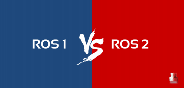
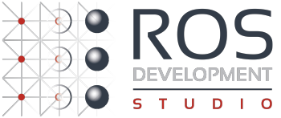
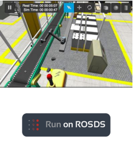
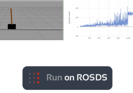
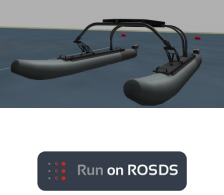

# Заключительные рекомендации.

**Я закончил, и что теперь?**

**Студия развития ROS \(ROSDS\)**

ROSDS - это веб-инструмент Construct для программирования роботов ROS онлайн. Не требует установки на вашем компьютере. Следовательно, вы можете использовать любой тип компьютера для работы на нем \(Windows, Linux или Mac\). Кроме того, бесплатные аккаунты доступны. Создайте бесплатный аккаунт ROSDS здесь: [http://rosds.online/](http://rosds.online/) 

Вы можете использовать любой из множества доступных проектов, чтобы применить все то, что вы узнали в ходе курса. Вам просто нужно вставить ссылку в URL-адрес вашего браузера, и вы автоматически подготовите симуляцию в своем рабочем пространстве ROSDS.

Ниже вы можете посмотреть некоторые примеры проектов, которые мы предоставляем: 

**Конкурс ARIAC**

Ссылка на проект: [https://bit.ly/2t2px0t](https://bit.ly/2t2px0t)

Обучение укреплению Cartpole

Ссылка на проект: [https://bit.ly/2t2uGWr](https://bit.ly/2t2uGWr)

**RobotX Challenge**

Ссылка на проект: [https://bit.ly/2Tt4lw8](https://bit.ly/2Tt4lw8)

Хотите узнать больше?

